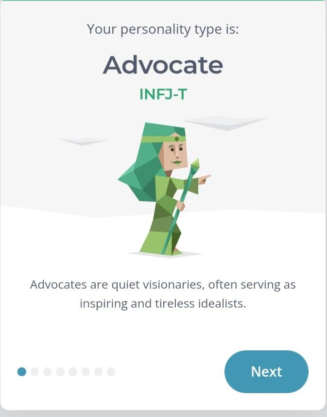
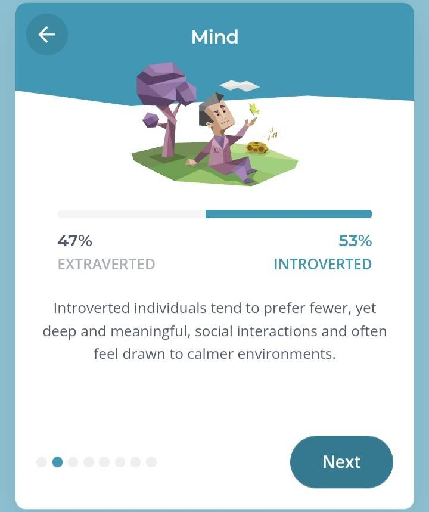
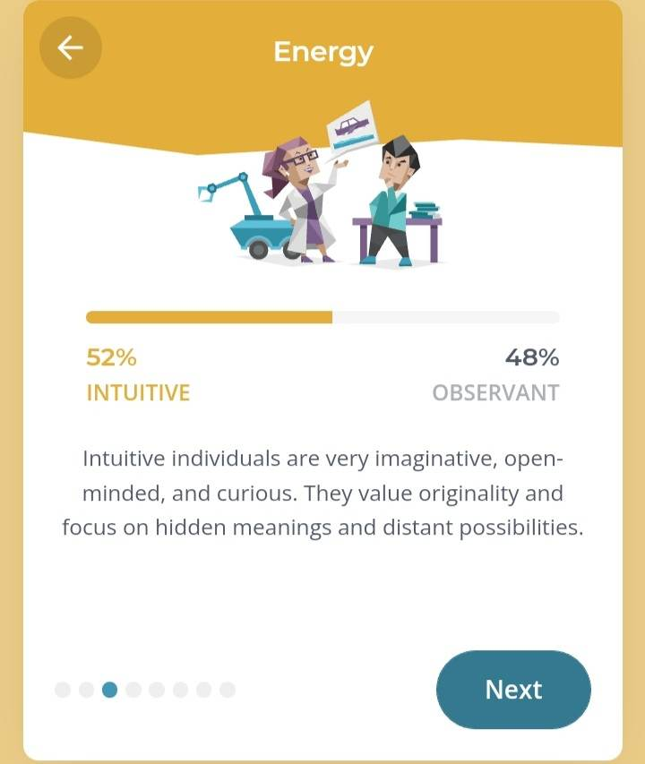
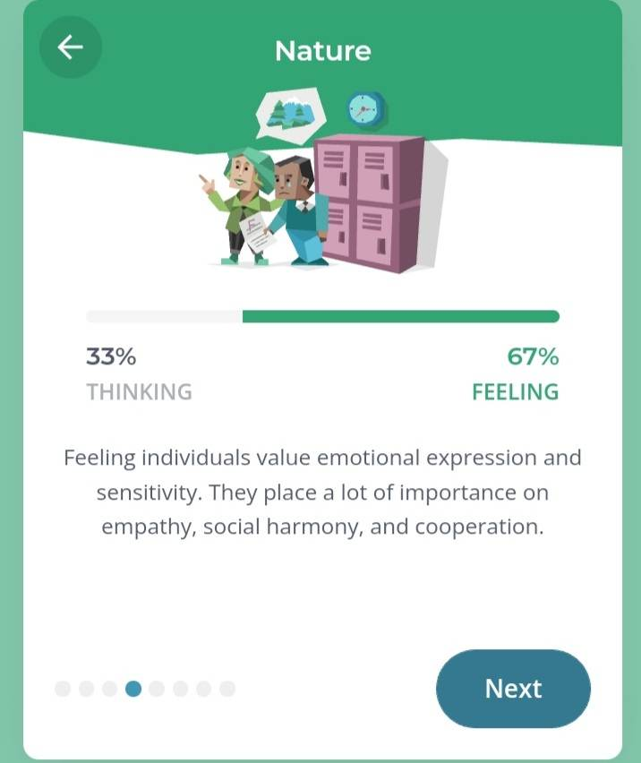
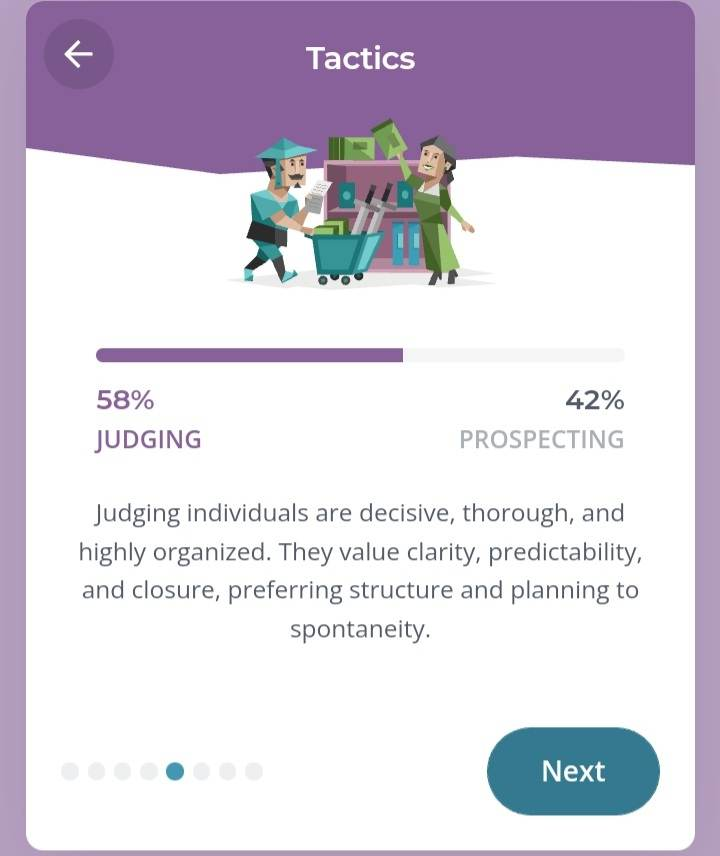
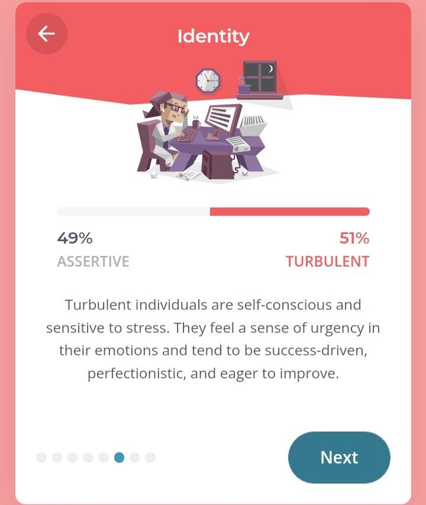

{: .mx-auto.d-block :}
This is my Personality which is INFJ-T

{: .mx-auto.d-block :}
Introverted to Extroverted Ratio

{: .mx-auto.d-block :}
Intuitive to Observant Ratio

{: .mx-auto.d-block :}
Thinking to Feeling Ratio

{: .mx-auto.d-block :}
Judging to Prospecting Ratio

{: .mx-auto.d-block :}
Assertive to Turbulent Ratio

