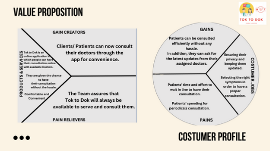
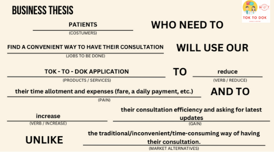
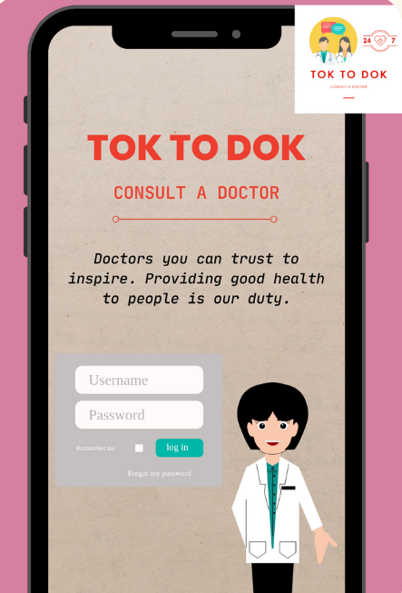

## VALUE PROPOSITION AND BUSINESS THESIS

{: .mx-auto.d-block :}
The customer profile is well-aligned with the value map of the Tok to Dok app. Customers who experience inconvenience or difficulty can rely on the app's services without worry. 
The Tok to Dok app is designed to cater to their needs and provide them with hassle-free healthcare solutions.

{: .mx-auto.d-block :}
In case of minor illnesses or discomfort, seeking medical attention can be as easy as using your phone to consult with a doctor, regardless of your location. 
With the Talk to Doctor app, patients can quickly and conveniently access healthcare services without having to physically visit a clinic or hospital.

### BENEFITS OF TOK TO DOK APPLICATION

~~~
***More prompt care and diagnosis, less hassle***
With the Tok to Dok app, patients can receive prompt care and diagnosis with minimal hassle. 
The app eliminates the need to wait in long lines at the clinic by enabling patients to 
consult with doctors online, resulting in faster access to medical advice and treatment. 
The app's online platform also enables patients to access healthcare services from the 
comfort of their own homes, which can save time and effort.
~~~

~~~
***Convenience from wherever you are ***
With the Tok to Dok App, patients and caregivers no longer have to travel to clinics or 
wait for appointments.  Instead, they can conveniently schedule and attend appointments 
from the comfort of their own homes, offices, or even during commutes. This saves time 
and effort, allowing patients to focus on their recovery. The app provides a more accessible 
and convenient way for patients to access healthcare services and medical consultations.
~~~

~~~
***Reduced risk of exposure to lingering germs***
The Tok to Dok app minimizes the risk of spreading germs and reduces the need to visit 
crowded places. Patients can avoid exposure to infectious diseases by using the app to 
consult with doctors remotely, without having to physically go to the clinic or hospital. 
This is particularly beneficial during times of widespread illnesses, such as flu season 
or pandemics. The app provides a safe and convenient alternative to in-person medical 
consultations.
~~~

{: .mx-auto.d-block :}
